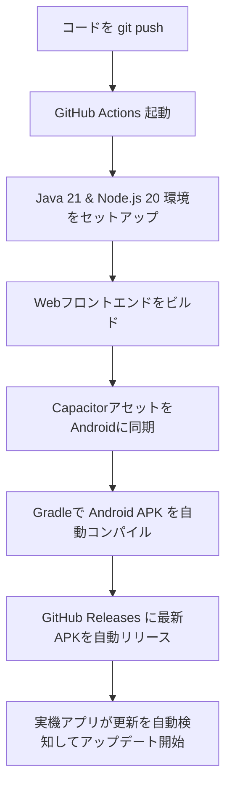

# 🍕 ぴっざぁ市民総合ポータル (Pizza Citizen Portal)

[](https://github.com/PizzaRoleplayOfficial/pizza-citzen-portal/actions/workflows/build-and-release.yml)


Roblox Pizza Roleplay ゲーム内で運用される、市民登録および車両登録申請を管理するためのハイブリッド・モバイルアプリ ＆ 統合Webポータルです。
Capacitor を採用し、Web の表現力とモバイルネイティブならではの強力な機能を融合させたプレミアムな体験を提供します。

---

## 🌟 主な機能 (Features)

### 🧑‍💼 一般市民向け機能
* **市民登録申請**: ディープリンクを用いた Discord 連携ログインにより、なりすましを防ぎつつスムーズな登録申請が可能。
* **マイガレージ (車両登録)**: 所有車両を写真付きで登録し、審査待ち・承認済みなどの状態を一元管理。
* **ナンバープレート自動読み取り (OCR)**: Tesseract.js を駆使し、アップロードした写真からナンバープレート番号を自動認識してフォームに自動入力（ベータ機能）。
* **リアルタイムローカル通知**: バックグラウンドでのポーリング処理により、車両や市民の「承認」「却下」などのステータス変化を捉え、実機の通知センターにローカル通知を発行します。

### 👑 運営（管理者）向け機能
* **統計ダッシュボード**: 登録市民数、車両数、保留中の申請数をグラフで視覚的かつ直感的に把握。
* **カスタム審査モーダル (グラスモーフィズム)**: 審査時に「写真からプレートが確認できません」などの頻出却下・警告理由をワンタップで入力できるカスタムテンプレート機能を完備。

### 🚀 ストア不要！シームレス自動更新システム (Pattern B)
* **GitHub Releases API 連携**: アプリ起動時に GitHub Actions でビルドされた最新のリリースアセットを自動検知。
* **すりガラス調アップデートUI**: ネオングリーンに輝くプログレスバーとともに、アプリ内でシームレスにダウンロードを実行。
* **自作ネイティブプラグイン**: Android OSのパッケージインストーラーを動的に呼び出し、ブラウザを介さずに上書きインストールが完結します。

---

## 🛠️ 技術スタック (Tech Stack)

| レイヤー | 技術 / ライブラリ | 役割 |
| :--- | :--- | :--- |
| **Core / Frontend** | React 18, TypeScript, Vite | 超高速なSPAと型安全なフロントエンド開発 |
| **Styling** | Vanilla CSS + すりガラスUI | ガラスモルフィズム、ダーク・ライトテーマの動的切替 |
| **Native Wrapper** | Capacitor 8.x | ネイティブ通知、ファイルシステム、ステータスバー同期 |
| **Infrastructure** | Cloudflare Pages, D1 | 世界最速レベルのWebホスティング ＆ エッジデータベース |
| **Backend / API** | Cloudflare Workers, Wrangler | サーバーレスAPIによる高速リクエスト処理 |
| **CI / CD** | GitHub Actions | `main`プッシュ時の自動ビルド ＆ Releasesへの自動デプロイ |

---

## 🤖 自動ビルド ＆ リリースパイプライン (CI/CD)

このリポジトリは GitHub Actions と完全連動しており、開発の手間をゼロにする自動ビルド・リリースシステムが組み込まれています。



* **通常プッシュ (`main`):** `latest` タグのプレリリースとして、常に最新のデバッグ署名付きAPK (`ぴっざぁ市民総合ポータル.apk`) が上書きアップロードされます。
* **リリースプッシュ (`v*`):** `v1.3.2` などのバージョンタグをプッシュした際、そのタグ名の新規リリースを作成してAPKをアタッチします。

---

## 💻 開発 ＆ ビルド手順

### 1. 準備 (セットアップ)
依存パッケージをインストールします：
```bash
npm install
```

### 2. ローカルWebサーバーの起動
WebフロントエンドとサーバーレスAPIのエミュレート環境を起動します：
```bash
# Cloudflare Pages / D1データベースのシミュレータをプロキシして起動
npm run pages:dev
```

### 3. Webアプリのデプロイ (Cloudflare Pages)
変更をコンパイルし、本番環境へデプロイします：
```bash
npm run pages:deploy
```

### 4. Androidアプリのビルド ＆ 同期
Webアセットをビルドした上で、Androidスタジオ向けに同期をかけます：
```bash
# Webビルド
npm run build

# Androidプロジェクトへ同期
npx cap sync android
```
同期完了後、`android` ディレクトリを Android Studio で開くか、`cd android && ./gradlew assembleDebug` コマンドで直接ローカルビルドを実行できます。

---

## 📝 ライセンス
© 2026 Pizza Roleplay Official. All Rights Reserved.
